# WBO (WeBcamera Offline)

**WBO** is a self-hosted, LAN-only video transmission tool designed to replace cloud services like VDO.ninja in unstable network environments. It provides low-latency, high-quality video streaming from a source (smartphone/laptop) directly to OBS Studio over the local network using WebRTC.

> **Why this exists:** Cloud-based video bridges introduce unnecessary points of failure (latency, regional blocking, ISP filtering). WBO keeps the traffic 100% local, ensuring the stream goes on even if the internet is down or external services are censored.

## ⚡ Features

* **Zero External Dependencies:** No need for STUN/TURN servers or public internet access. Works strictly over LAN.
* **Low Latency:** Uses direct WebRTC P2P connections between the camera source and the playback client.
* **Lightweight Signaling Server:** Written in **Go (Gin + Gorilla WebSocket)**, handling SDP exchange with minimal overhead.
* **OBS Ready:** Designed specifically for integration as a Browser Source in OBS Studio.

## 🏗 Architecture

The system consists of a lightweight Go signaling server and two types of clients (Streamer and Viewer).

```mermaid
sequenceDiagram
    autonumber
    participant Cam as 📱 Smartphone (Camera)
    participant Srv as 🚀 Go Server
    participant OBS as 🖥 OBS Studio

    Note over Srv: Server listening on :8080
    
    Cam->>Srv: Connects to /?stream (WebSocket)
    OBS->>Srv: Connects to / (WebSocket)
    
    rect rgb(30, 30, 30)
        Note over Cam, OBS: Phase 1: The "Handshake" (Signaling)
        Cam->>Srv: "Hey, I want to stream. Here are my specs."
        Srv->>OBS: "Someone wants to stream. Can you handle it?"
        OBS->>Srv: "Yes, I'm ready. Send the data here."
        Srv->>Cam: "All set! Start sending frames."
    end

    Cam->>OBS: Exchange Local IPs (ICE Candidates)
    
    rect rgb(0, 40, 0)
        Note over Cam, OBS: Phase 2: LIVE STREAM (Direct LAN P2P)
    end
```



## 🛠 Tech Stack

* **Backend:** Go (Golang), Gin Web Framework, Gorilla WebSocket.
* **Frontend:** HTML5, Vanilla JS.
* **Protocol:** WebRTC (RTCPeerConnection) for media, WebSocket for signaling.

## 🚀 Quick Start

### Prerequisites

* Go 1.22+ installed.
* A device with a camera (Phone, Laptop) and a PC with OBS connected to the same Wi-Fi/LAN.

### 1. Run the Signaling Server

```bash
# Clone the repository
git clone https://github.com/Votline/WBO
cd WBO

# Run the server
go run main.go

```

The server will start on `0.0.0.0:8080`.

### 2. Connect the Camera (Source)

On your phone or laptop:

1. Open your mobile browser.
2. Navigate to: `http://<SERVER_IP>:8080/?stream`
   > **Note:** Replace `<SERVER_IP>` with the local IP address of the machine running the Go server (e.g., `http://192.168.1.55:8080/?stream`).
3. Grant camera permissions and click **"Start Stream"**.

### 3. Setup OBS (Receiver)

1. Open **OBS Studio**.
2. Add a new source: **Browser Source**.
3. URL: `http://<YOUR_PC_LOCAL_IP>:8080` (without `?stream`).
4. Check **"Control audio via OBS"** if you need sound.
5. The video feed should appear instantly.

## 🔧 Configuration details

To find your local IP address:

* **Any OS** You can find the device's IP address on your router's website. (example url: `192.168.31.1`)
* **Windows:** `ipconfig` (Look for IPv4 Address)
* **Linux/macOS:** `ifconfig` or `ip a`

## ⚠️ Networking Note

Since WBO uses raw WebRTC without a TURN server, both devices **must** be on the same local network subnet.

## License

- **License:** This project is licensed under  [MIT](LICENSE)
- **Third-party Licenses:** The full license texts are available in the  [licenses/](licenses/)
